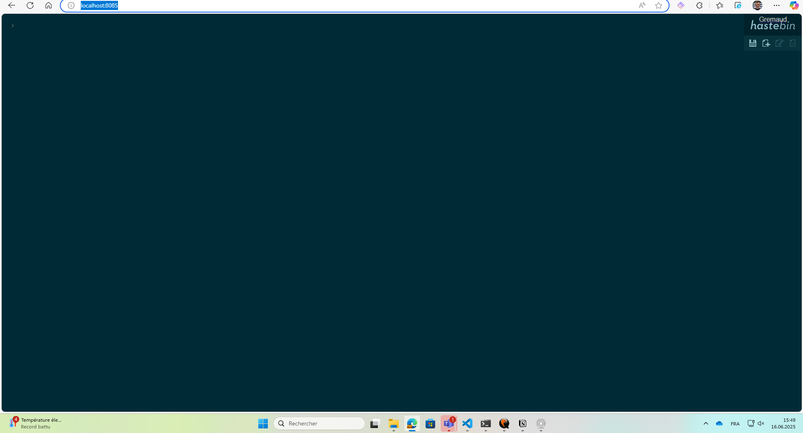

# Construction

Alors ce qu'il faut pour construire l'application est tout d'abord d'avoir ces 3 fichiers dans notre répertoire de projet :

1. Dockerfile
2. dans un dossier settings
   1. config.json
   2. index.html

Ensuite, à la racine du répertoire de projet, on lance la commande suivante qui va build l'image :

```bash
docker build -t hastebin-image .
```

Une fois builder, on peut déjà lancer le conteneur avec l'image personnalisé, voici la commande :

```bash
docker run -d -p 8085:8085 --name hastebin-app hastebin-image
```

Et donc ensuite notre conteneur va démarrer, il ne nous reste plus qu'à accéder à l'application sr l'URL suivante :

```
http://localhost:8085/
```

# Personnalisation

J'ai juste dû changer la valeur de ces trois champs dans le config.json:

```json
 "port": 8085,
 "keyLength": 5,
 "maxLength": 10,
```

Cela fait que j'ai donc mis le port 8085 à l'app, la longueur de la clé à 5 en random toujours et le paste est à une longueur max de 10.

Aussi dans le index.html, j'ai changé le nom Colella par Gremaud, j'ai mis Valentin à la place de Dimitri et j'ai fini par mettre la valeur du logo twitter à false pour le désactiver.

# Capture d'écran

Ci dessous une capture d'écran de l'application lancé.

